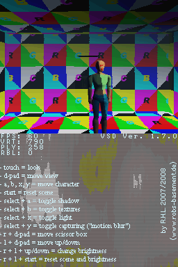
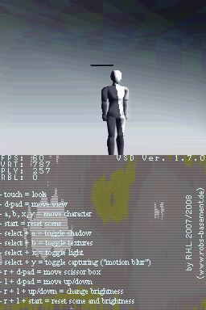

Volumetric Shadow Demo 1.7.2
============================

Introduction
------------

First of all: Thank you for downloading the demo!

The "Volumetric Shadow Demo" is an NDS graphics hardware technology demo, which
is mainly targeted towards new NDS developers, who want to see how to activate
and utilize some of the NDS' graphics hardware features. Read the
[tutorial](./volumetric-shadows-nds.tutorial.md) to understand how to achieve
this effect in your own programs.

This demo was originally built with devkitARM R23b, libnds 20071023 and libfat
20070127, using the `touch_look` example of libnds as base. Credit and thanks go
out to their respective authors. Credit also goes to gabebear for his scissor
pick matrix implementation.

Very special thanks go out to Larry E. and Brandon M. for helping me out with
the hardware! This demo and much more wouldn't have been possible without your
help!

Also, special thanks and greetings to everybody at the gbadev.org forum!

Special greetings to tepples, simonjhall and Alphanoob!

This version has been ported to BlocksDS by Antonio Niño Díaz.

**Important: Everybody should please read the disclaimer section below!**

 

Features
--------

The demo shows, among other things, how the following can be done:

- Reading text and binary files with NitroFS, including routines for different
  file types, like .tga and some of my own, very basic formats
- Using textures, lighting, viewport scissoring, the display brightness control
  register (9 levels used), fog, anti aliasing, motion blur with capturing
  (using only one VRAM bank, at 60 FPS)
- Displaying a custom font and a text area over a background image
- Simple frame rate counting and display
- Smooth touch input
- ... and of course: HARDWARE ACCELERATED, VOLUMETRIC SHADOWS

NOTE: To see how such shadows are rendered, read the mini-tutorial, which comes
with the source release. Feel free to additionally read the source file
comments, e.g. "tgaloader.cpp" includes some information about the .tga format.

Compatibility
-------------

In order to run this demo on hardware, load it with a loader that supports the
argv protocol, such as NDS Homebrew Menu. All the data required by the demo is
embedded in the NDS ROM.

Depending on your device, you may have to manually DLDI patch the .nds file to
make it work. Your card's manufacturer can help you with how to accomplish that.

This demo should also work in emulators thanks to using NitroFS.

Controls
--------

Just as displayed during the demo itself:

- touch = look
- d-pad = move view
- a, b, x, y = move character
- start = reset scene
- select + a = toggle shadow
- select + b = toggle textures
- select + x = toggle light
- select + y = toggle capturing ("motion blur")
- r + d-pad = move scissor box
- l + d-pad = move up/down
- r + l + up/down = change brightness
- r + l + start = reset scene and brightness

Disclaimer
----------

Feel free to use the sources for whatever you like. I release them (as well as
the binaries and data) without any kind of warranty - use at your own risk.
Therefore, I must not be taken reliable for any direct or indirect damage the
usage or storage of and any other action involving the source files or binaries
might cause.
That, of course, should never happen! The demo wasn't designed to destroy
anything. :^)

If you decide to use some lines from this demo, I hereby nicely ask you to include
a little note containing the URL of my web site (www.robs-basement.de) somewhere
appropriate in your program or its documentation. Thank you!

The included example data are my own humble creations - please don't use them in
any other way, only as intended to: example data for this demo.
(I don't expect anyone to actually want to "borrow" them anyway.)

As usual, neither have the program sources, nor have I been in any way associated
with or connected to Nintendo at the time of initial creation and release of this
demo.

Only publicly available information, tools and libraries have been used to create
the program.

Nintendo, the Nintendo DS, the Nintendo and the Nintendo DS logos are trademarks
of Nintendo.
(The NDS *ROCKS*! Thank you guys for releasing such a wonderful platform!)

Happy programming!

R.H.L. (a.k.a. silent\_code at the gbadev.org forum)
by [www.robs-basement.de] 2007 - 2008

Contact me via "vsd at 'my place' followed by a dot and a de" or
alternativley via the gbadev.org forum.

Changelog
=========

NOTE: The revison of version X.Y.Z is Y.Z, where X is the major version, Y is
the minor version and Z is the revision number.

Version 1.x.x
-------------

Revision 7.2:
- Fix code that initializes the custom font of the console.

Revision 7.1:
- Update format of documentation.

Revision 7.0:
- Migrated to BlocksDS.
- Switched to using NitroFS instead of libfat.

Revision 6.0:
- Fixed the tutorial (thanks to zeruda!) :^)
- Fixed a typo in the readme (thanks to jello!) ;^)
- Updated the readme.
- Cleaned up console initialization and propper use of libnds' definitions.
- Fixed material / lighting bug.
- Added and fixed come source comments.
- Fixed initialization function.
- Fixed the view class and its usage.
- Replaced the floating point gluPerspective() whith its fixed point
  counterpart.
- Reworked some parts of the mesh rendering.
- Removed last bits of "useless stuff."

Revision 5.1:
- Fixed the scissor class and renamed its methods.
- Fixed fopen() usage.
- Reduced file path to 31 (+ \0) characters and renamed some files.
- Cleaned up glEnable() usage.
- Added vertex and primitive list RAM usage display.
- Added free render buffer lines display.
- Readme has been fixed and updated.

Revision 5.0:
- Renamed to "Volumetric Shadow Demo"
- Fixed input bug: textures could not be toggled.
- Fixed: Single "include all" header style was remedied with only including and
  declaring what is needed in each compilation unit.
- Restructured some source files.
- Removed ARM7 source file and rearranged the project to ARM9 only. (Using the
  default ARM7 binary.)
- Changed to unmodified default Makefile.
- Changed the source usage "policy" a little bit.
- Separated the tutorial from the readme.
- Readme has been updated accordingly.

Revision 4.0:
- Did quite some source clean up, rewriting and rearranging.
- Added view and scissor box classes.
- Added data directory support.
- Added better error detection and handling.
- Changed fog table generation.
- Renamed a lot of variables and functions.
- Added some more comments.
- Fixed some typos in the readme and updated it.

Revision 3.0:
- Changed filesystem to libfat.
- Added frame rate counter.
- Added touch input smoothing. (Need to fix the slight drifting tendency.)
- Fixed the fog color.
- Rearranged and cleaned up the sources.
- Updated and fixed the readme.
- Cleaned up and fixed the tutorial.

Revision 2.0:
- Moved to devkitARM R23b.
- Moved to libnds 20071023 and updated the sources where needed.
- Fixed the readme. (as usually)
- Slightly changed the .pbi format - old data and routines are incompatible!
- Fixed "odd" loading routines.
- Fixed some minor bugs.
- Cleaned up the sources a little bit.
- Added some info about the .tga format in "tgaloader.cpp".
- Added a controls overview at the bottom screen.

Revision 1.3:
- Fixed and rearranged some things in the readme. (again)
- Changed the term "shadow volumes" to the more precise term "volume shadows"
  in the readme.
- Added a mini-tutorial section.
- Moved to libnds 20070503 and made some needed adjustments to the sources.
- Added hardware fog.
- Added capture support and a slight motion blur effect.
- Added some new controls.

Revision 1.2:
- Fixed and rearranged some things in the readme.
- Moved to libnds 2007050 and made some needed adjustments to the sources.
- Removed my FIX versions of previously 'broken' libnds funktions.

Revision 1.1:
- Fixed and added things to the readme: additional thanks ;^D, change log,
  controls (silly me) etc.
- Replaced the shadow volume with a better suited (and simpler) one.
- Fixed the controls.

++ Initial release 1.0 ++
